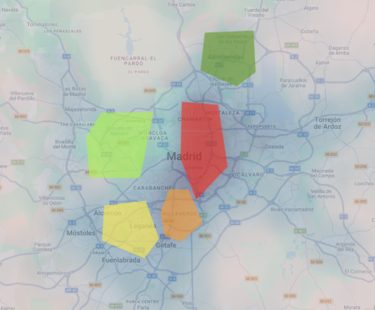
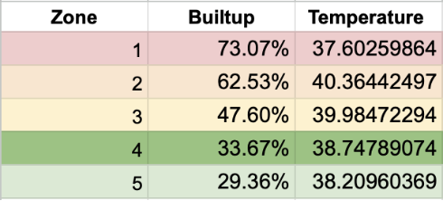
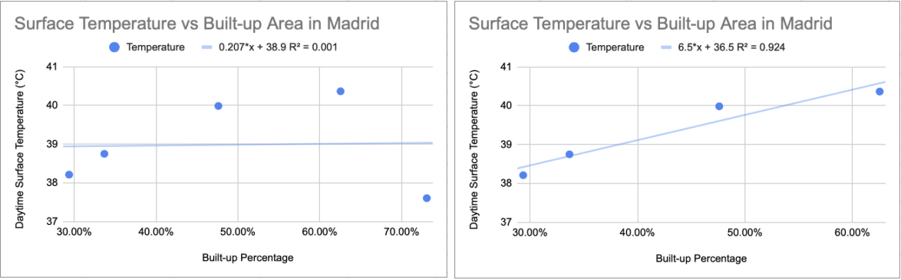

# Surface Temperature and Built-up Area in Madrid 

The goal of this project is to investigate the relationship between surface temperature and percentage of built-up area in the city of Madrid

## Tools used: 
- Google Earth Engine
- Javascript

## Files
- `script.js` – main Earth Engine code
- `results/` – exported map visualization and plots

## Datasets used: 
1) Global monthly daytime land surface temperature generated by the [Malaria Atlas Project at Oxford University](https://www.bdi.ox.ac.uk/research/malaria-atlas-project)
2) Global built-up area in the [Global Human Settlement Layer](https://human-settlement.emergency.copernicus.eu/ghs_bu2019.php) data generated by the European Commission

## Results 

## Live GEE Script
[Open the Google Earth Engine script here](https://code.earthengine.google.com/7671ca8ea04cc0816d6e3dacc1dcacb2)
